## AWS Cloud Engineer

**Greetings! We'll be going over the tasks for Week 6 - Days 2 of the Cloud Engineering program. Lets get started!**

## Week 6 - Day 2: Action Steps
* Research and Explain Kubernetes
* Define a Kubernetes Deployment
* Create a Kubernetes Service
* Simulate Scaling in Kubernetes
* Self-Healing in Kubernetes
* Reflect on Kubernetes Benefits
________________________

## Research and Explain Kubernetes

Today is all about Kubernetes!

Everybody is afraid of Kubernetes (K8s, for short). Why? Because they don't understand Linux? They don't understand virtualization? Containers? It's not that scary. Like with everything in tech, it can get complex but lets just go over the basics today. 

The smallest part of Kubernetes is a pod. A pod is the smallest deployment unit for K8s and it runs your containers. Usually, 1 pod runs 1 container although it can run more. For simplicity, lets say one pod runs one container. 

A node is a compute resource. To keep it simple, lets just call it a virtual machine (VM or EC2 instance). 1 or more pods can live on a node. The next level is a cluster. A cluster is a collection of nodes. A cluster usually containers a master node that is the control plane (issues commands) and worker nodes (do the work). 

Now that we have the basics out the way, lets actually get K8s up and running!

## Define a Kubernetes Deployment

Now for those of you who are new to K8s, you're probably wondering how do we even get this thing started? If you've been following my previous labs, we've installed Terraform, Docker, and other services from their company's webpage. Well, K8s is a little different. We can actually use a basic version of K8s using the Docker Desktop application instead of having to install it. 

Docker and K8s are two separate tools from two separate companies but since K8s is the world leader in container orchestration, Docker also allows K8s commands in their application. First, create a Docker Hub account so we can push our image from our Docker lab to our account for K8s to use. 

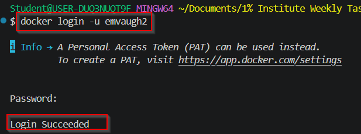

Once you've done that, push the same image we created to our account. We need to make a few modifications to the image though. Add the account name to the image and give it a tag at the end of the image name. This is so K8s can definitively search for it. 

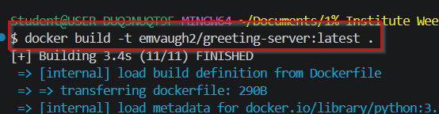

Use `docker push <username>/<image-name>:<tag>` to actually place the image in your Docker account. 

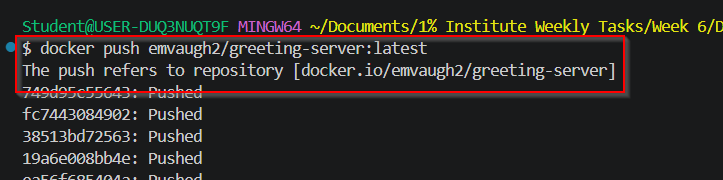

You can either check your Docker Desktop application or the WebUI portal to see if your image was pushed to your account. 

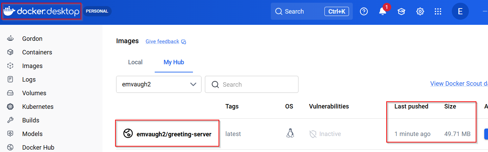

Now, before we start to activate K8s, lets actually go over our the different parts of our deployment file. It's written in YAML so it keeps the same dictionary and list format as Ansible. We have the apiVersion which determines which verion of Kubernetes API should handle this object. There are multiple API groups so we're choosing API group `app` and the version 1 of that. 

The `kind:` is deployment which we'll change to service in our service.yaml file. 

The metadata is arbitrarily named but this is what K8s will call this object. It's a unique identifier for this resource. The `name:` will also be the base name for the pods. `spec:` tells Kubernetes exactly what you want it to do. In our file, we want it to create 3 running pods and the `selector:` says find and manage pods with this label.

The `template:` tells Kubernetes how to create the pods. You give the template the specs as well which, for our case, we're creating the pod named `greeting-server` from the our Docker image which we want the world to know it runs on port 50000 (which should actually be 5000 which I later corrected). 

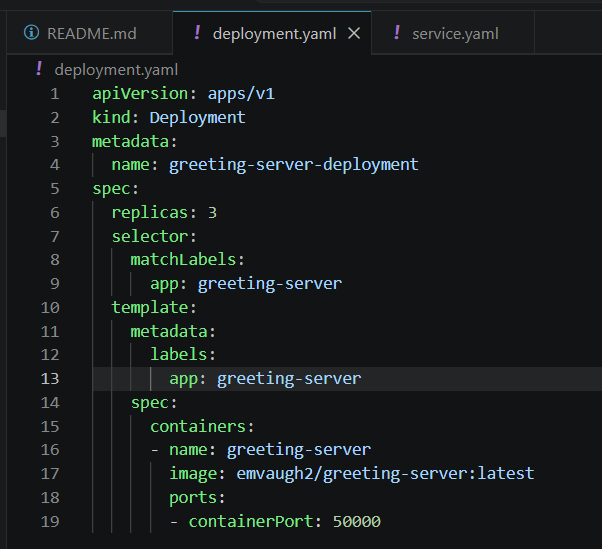

We'll leave the service file for the next section. 

## Create a Kubernetes Service

Our service file is a companion of our deployment file. It tells our traffic how to get to our application. It also has an apiVersion and kind. We're going with the v1 version of the core API. We're naming our service object `greeting-server-service` and we're selecting our pods named `greeting-server`. Now, we can get into the traffic portion. We're using a load balancer (LB) to take traffic that hits our node on TCP port 5000 and sends it to our container on port 5000. I later changed this port matching to be node port 80 to container port 5000. 

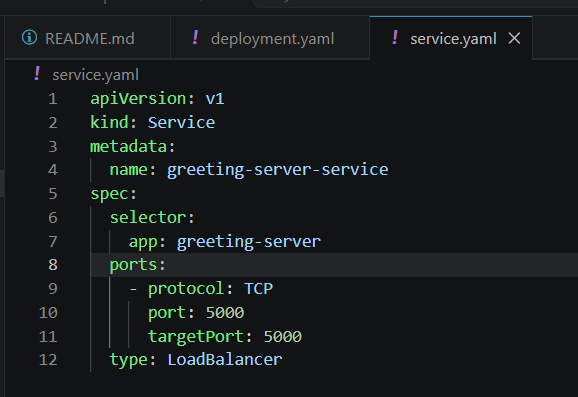

Now that we've dissected our YAML files, lets actually try to apply both of our files using `kubectl apply -f`. I ran into my first issue here which I ended up googling. Apparently, I didn't enable K8s. Lets handle that. 

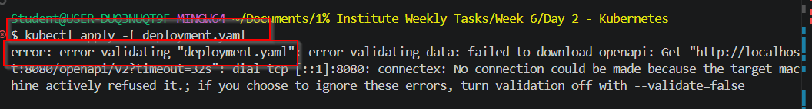

Go into the Docker Desktop app, navigate to the Settings gear, select Kubernetes from the left-hand tab, and enable Kubernetes. Use the default settings that they give you. 

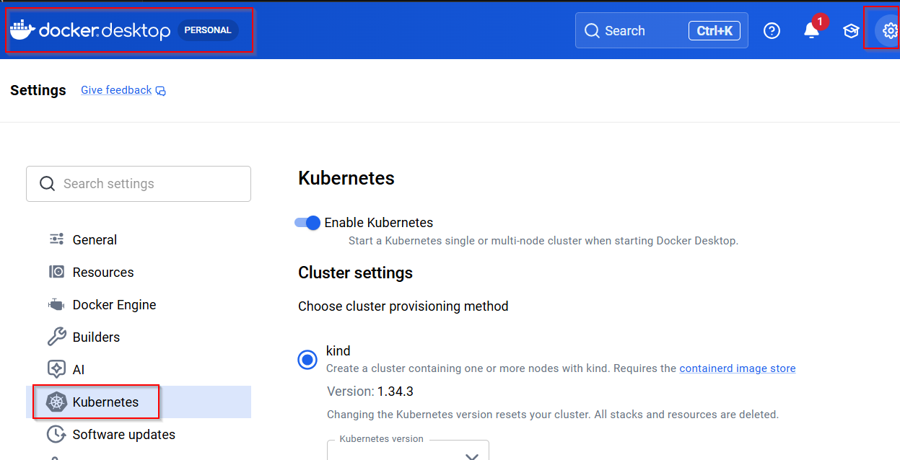

This takes about 5 minutes and you can actually view the status of Kubernetes initializing on the Desktop Docker app. 

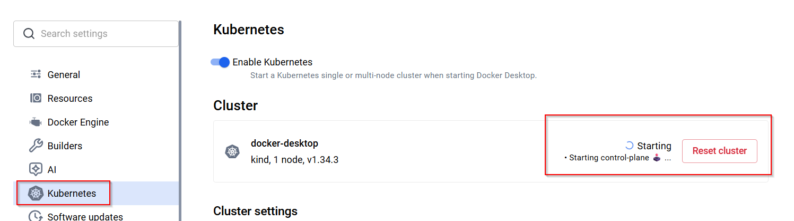

Once it has completed, you can see that K8s will now say Running! So now we can go back to our CLI and run the K8s commands. 

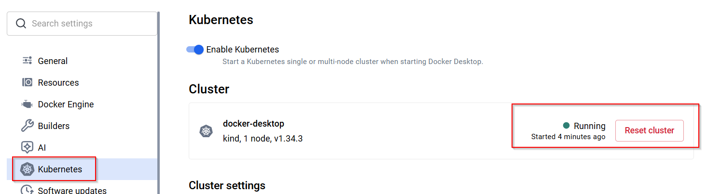

## Simulate Scaling in Kubernetes

We'll simulate scaling in our first run with Kubernetes once we deploy our first node since we included 3 replicas in our deployment.yaml file. 

First, lets also use the CLI to verify that K8s is up and running by using `kubectl get nodes`. Before we get too deep with kubectl, what is that command actually short for? It's short for Kubernetes control tool, similar to systemctl being short for system control in Linux. Below, you can see our node that Docker gave us. Notice, we didn't have to deploy our own master and worker VMs to get a node. Docker virtualized it for us in one swoop which is great for spinning up labs. It's less granular in control but it's perfect for what we're doing now. 

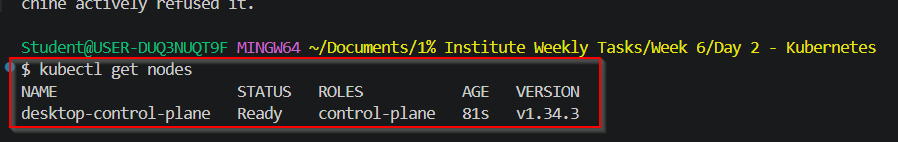

I'm going to run our `kubectl apply -f` and `kubectl get` commands for our deployment.yaml, service.yaml, pods, and svc (service) objects. 

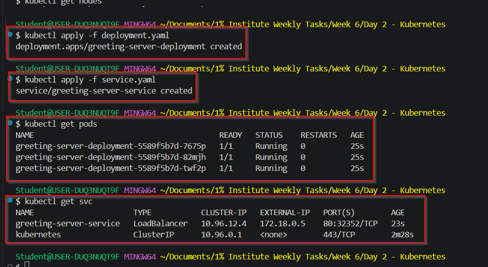

You can see the 3 replica pods that we created. They have the same base name and they're up and running. You can also see our LB service that we created with the object name we gave it. It gives a cluster IP and an external IP with matching ports. 

Here's is where I can into my second issue. My curl was not working to my local host or the external IP on the given ports.

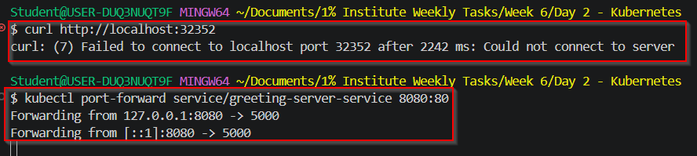

After doing some googling, I found that I can do port forwarding to bypass this issue. The port forwarding allows us to manually override the port matching and not have to be bothered with our IP addresses. So I referenced by service object and matched port 8080 on the node to port 80 in the service file. 

Once I did that, it opened up a running instance of the port forwarding where I had to open up a new Bash Git CLI to run my curl command. 

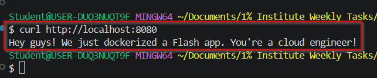

After running the curl command, I received my customized message! This confirms that my K8s setup is up and running! Hooray!

Lets make sure we preserve our hardware resources since my computer is very low budget so we'll use the `kubectl delete -f` commands on both our deployment and service objects to remove all the work we've done. We can also use `kubectl get` to see that our pods and our LB service have been terminated and removed.

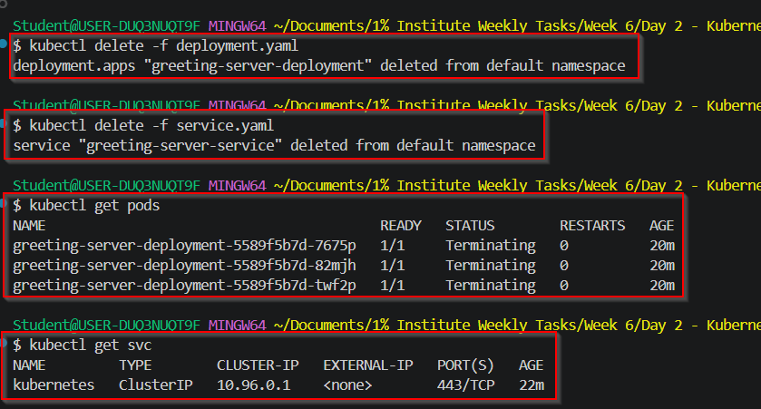

That concludes the demonstration part of our lab! 

## Self-Healing in Kubernetes

Lets discuss seal-healing in Kubernetes. If a pod for an application fails, K8s will replace it with a working pod because K8s is a declarative tool. You tell it the exact running state and what you want the environment to look like. K8s will keep this in mind and if the environment looks differently, it will self correct to make the environment return back to your specifications. 

## Reflect on Kubernetes Benefits

Modern day applications are really a combination of a bunch of smaller applications and services. We need to make sure all of these microservices work together in order to reliable deliver the service the overall application advertises. Each one of these applications can have dozens of running instances in containers to make the entire product work. This would be a nightmare to manually orchestrate so Kubernetes does a great job at automatically monitoring all of these containers for us. It's all about scale and that's where K8s allows us to do so with ease. 

## Personal Notes

This was my first time interacting with Kubernets in the Docker Desktop app so this was a nice learning experience. It was cool to see my app come alive with the pods. Makes me want to build something bigger and better to showcase my skill. I even ran into a few issues that I was able to correct so that was also fulfilling. Grateful 

